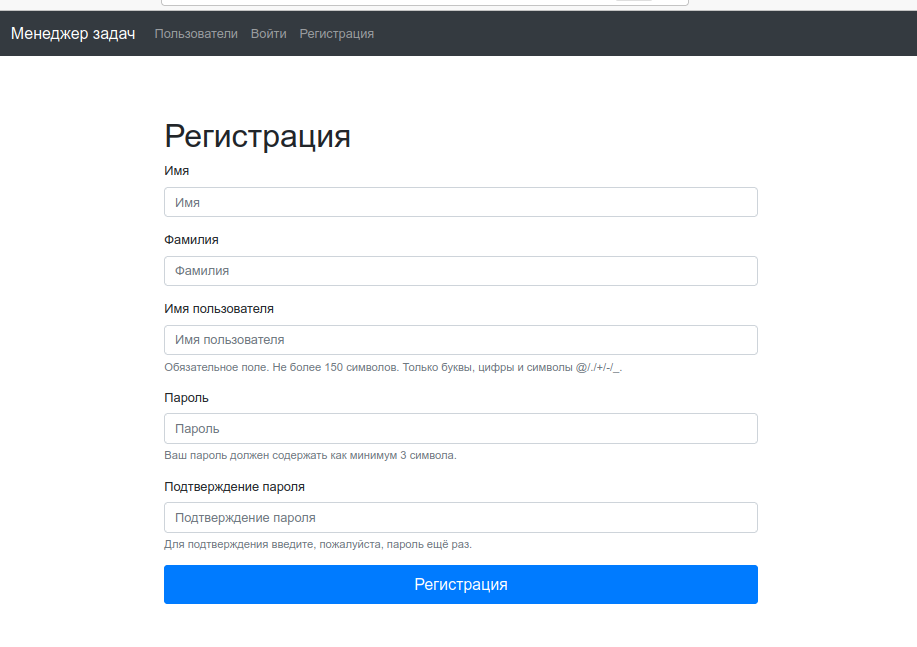
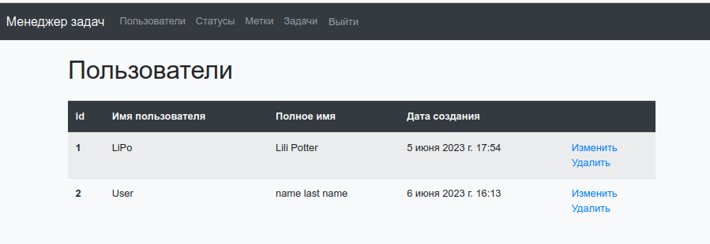
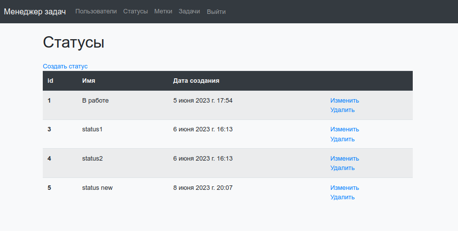
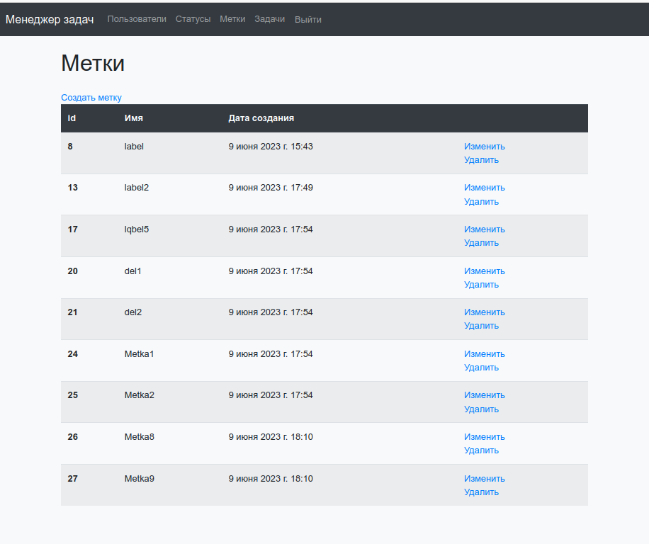
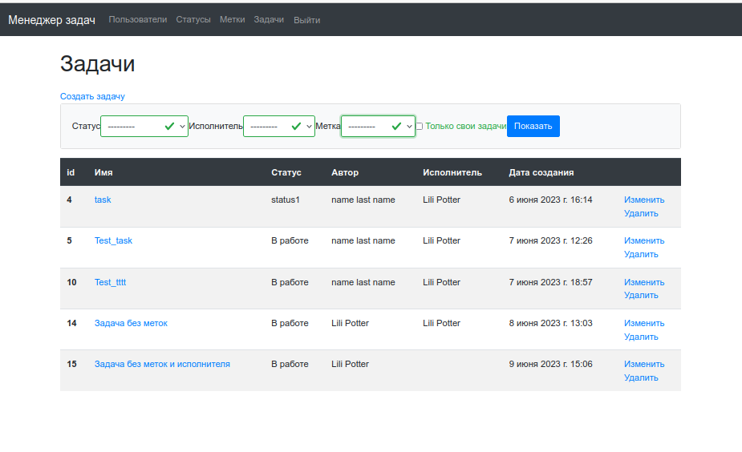
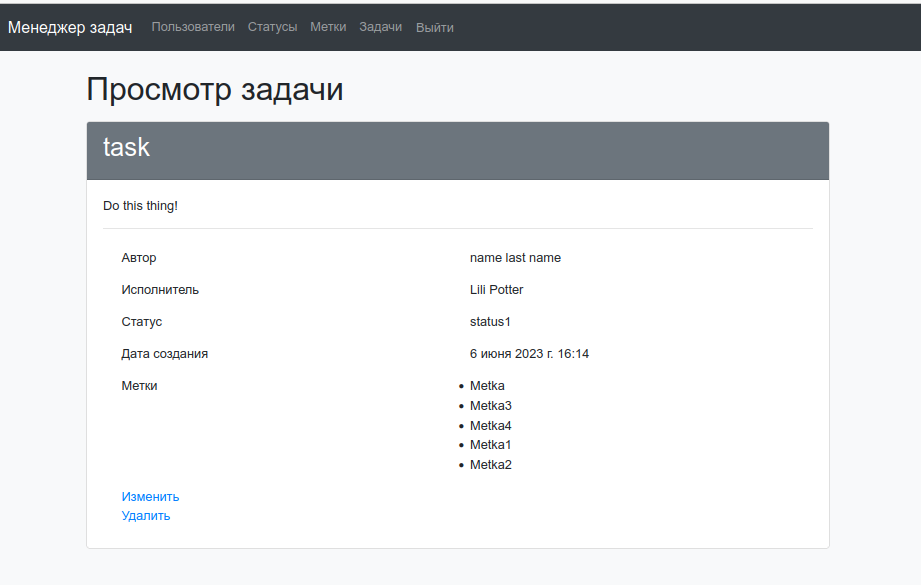

### Hexlet tests and linter status:
[](https://github.com/Dobrovera/python-project-52/actions) 

#### [link](python-project-52-production-8542.up.railway.app) to the domain


### About
<hr>
Task Manager is a task management system. Build with Python 3.8 and Django 4 framework

To work with the system, registration and authentication are required:



---

You can view the list of registered users



---

Authenticated users can view and create and delete **statuses** and **labels**




---

You can also create, edit and delete **tasks**



---

Detailed information on the task can be viewed on the task card




### What is used
<hr>
<li>Python 3.8</li>
<li>Django 4</li>
<li>Bootstrap 4</li>
<li>Flake8</li>
<li>Gunicorn</li>


### To run locally
<hr>

At first, clone the repository:

```
git clone https://github.com/Dobrovera/python-project-52
```

Next, create .env file in the root folder. You need to write some variables in it:

```
DATABASE_URL={provider}://{user}:{password}@{host}:{port}/{db}
SECRET_KEY={your secret key}
LANGUAGE=en-us # By default the app will use ru-ru locale
```

And runserver:

```
python3 manage.py runserver
```
